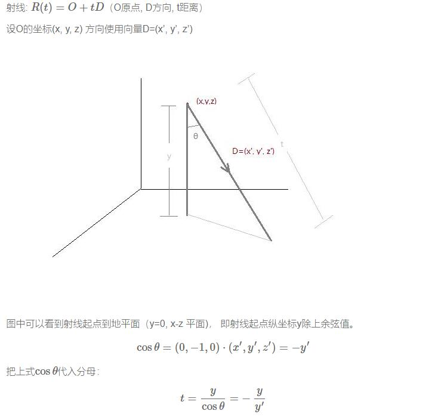
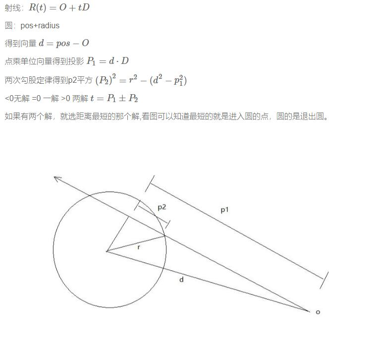
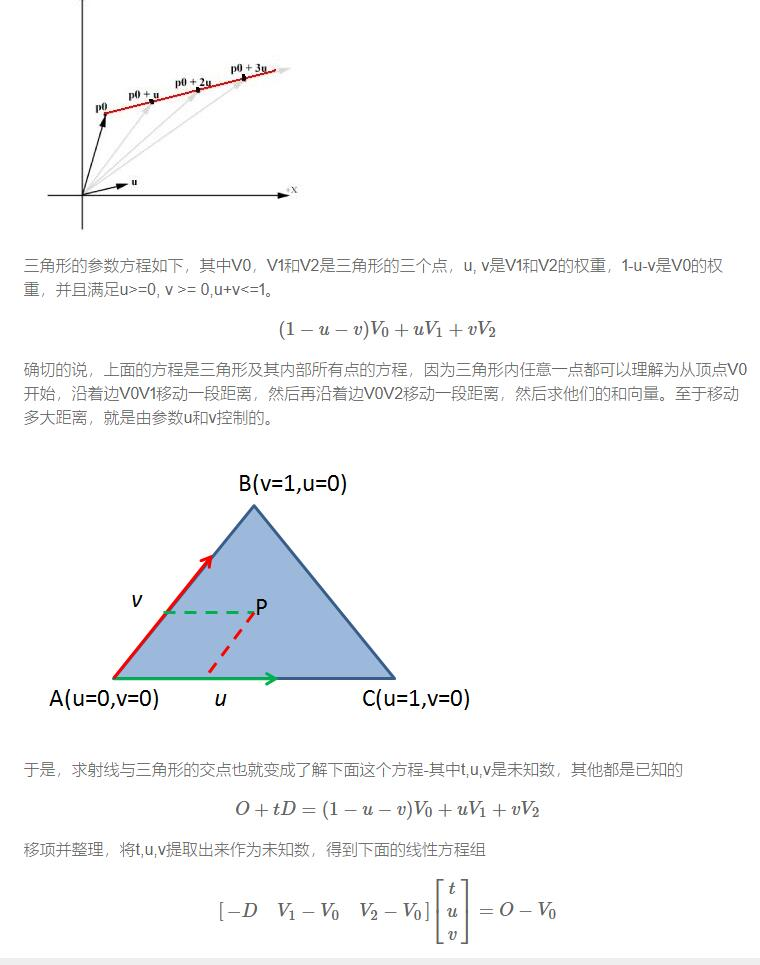
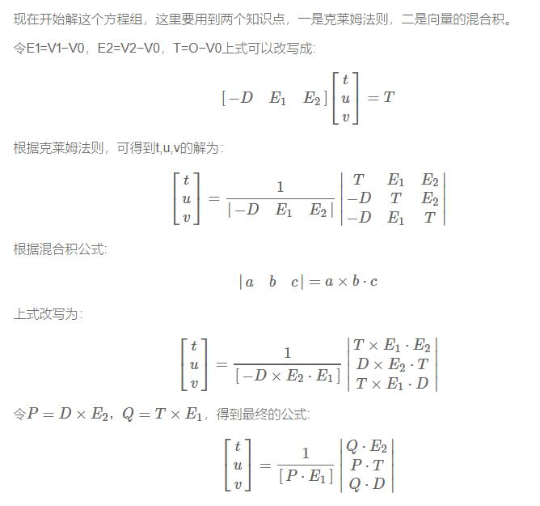

## 光线追踪

[GPU Ray Tracing in Unity – Part 1][i1]

* 光线追踪 
* 阴影


[GPU Ray Tracing in Unity – Part 2][i2]
 
 * 路径追踪 支持蒙特卡洛离散采样。 

 * 支持自发光效果。

[GPU Ray Tracing in Unity – Part 3][i3]

* 支持对Mesh射线相交算法


## Usage

克隆对应的仓库， 然后切换对应的分支

```sh
git clone https://github.com/huailiang/ray_tracing.git
cd ray_tracing
# 切換分支（Option）
git checkout pt2
```


## 射线相交算法

[说明文档][i4]

#### 1. 射线与平面相交

<br><br>

所以代码里实现如下：

``` c++
bool IntersectPlane(Ray ray) {
    t = -ray.origin.y / ray.direction.y;
    return true;
}
```

#### 2. 射线与球相交

<br><br>

```c++
bool IntersectSphere(Ray ray, float3 position,float radius,inout float t) {
    float3 d = ray.origin - position;
    float p1 = -dot(ray.direction, d);
    float p2sqr = p1 * p1 - dot(d, d) +radius*radius;
    if (p2sqr < 0)//不存在解也就是不相交
        return false;
    float p2 = sqrt(p2sqr);
    t = p1 - p2 > 0 ? p1 - p2 : p1 + p2;//优先选近的那个点，除非近的点在后头
    return true;
}
```

#### 3. 射线与三角形相交

射线：$R(t)=O+tD$

射线，一个点从起点o开始，沿着方向D移动任意长度，得到终点R，根据t值的不同，得到的R值也不同，所有这些不同的R值便构成了整条射线，比如下面的射线，起点是P0，方向是u，p0 + tu也就构成了整条射线。

<br>
<br><br>


```c++
static const float EPSILON = 1e-8;
bool IntersectTriangle_01(Ray ray, float3 vert0, float3 vert1, float3 vert2,
    inout float t, inout float u, inout float v,inout float toward) {
    //E1 E2
    float3 edge1 = vert1 - vert0;
    float3 edge2 = vert2 - vert0;
    //P=DxE2
    float3 pvec = cross(ray.direction, edge2);
    float det = dot(edge1, pvec);
    //背面det<0 正面>0 在三角形内=0
    if (det < EPSILON&&det >-EPSILON) return false;
    toward=sign(det);
    // 1/(DxE2)·E1    
    float inv_det = 1.0f / det;
    //T
    float3 tvec = ray.origin - vert0;
    //u=invdet *(P·T)
    u = dot(tvec, pvec) * inv_det;
    //如果三角形内的点，重心坐标一定在[0,1]
    if (u < 0.0 || u > 1.0f) return false;
    //Q=TxE1
    float3 qvec = cross(tvec, edge1);
    //v=invdet*(Q·D)
    v = dot(ray.direction, qvec) * inv_det;
    if (v < 0.0 || u + v > 1.0f) return false;
    //t=Q·E2  
    t = dot(edge2, qvec) * inv_det;
    return true;
}
```

## 参考资料

* [GPU Ray Tracing in Unity][i1]
* [克莱姆法则, wikipedia][i5]
* [重心坐标, wikipedia][i6]
* [UE里的光线追踪实现][i12]
* [蒙特卡洛 渲染方程论文][i13]

[i1]: http://blog.three-eyed-games.com/2018/05/03/gpu-ray-tracing-in-unity-part-1/
[i2]: http://blog.three-eyed-games.com/2018/05/03/gpu-ray-tracing-in-unity-part-2/
[i3]: http://blog.three-eyed-games.com/2018/05/03/gpu-ray-tracing-in-unity-part-3/
[i4]: https://penghuailiang.gitee.io/blog/2020/ray/
[i5]: https://zh.wikipedia.org/wiki/克萊姆法則
[i6]: https://zh.wikipedia.org/wiki/重心坐标
[i12]: https://devblogs.nvidia.com/introduction-ray-tracing-unreal-engine-422/
[i13]: http://www.cse.chalmers.se/edu/year/2011/course/TDA361/2007/rend_eq.pdf